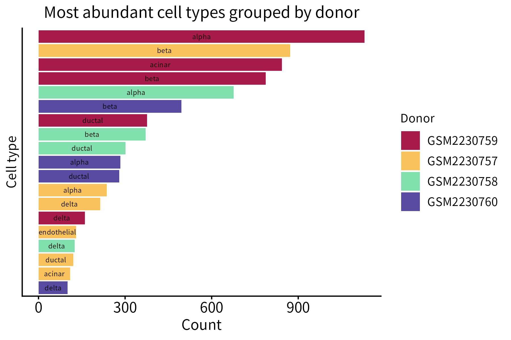
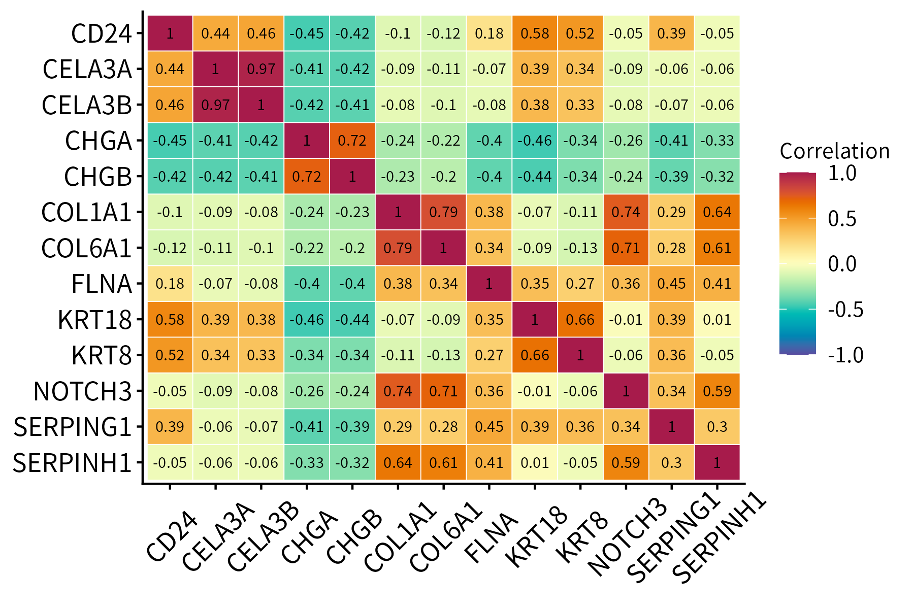
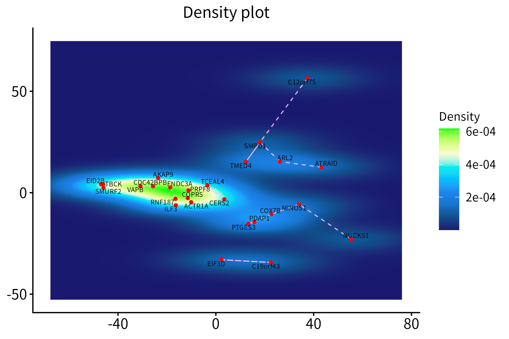
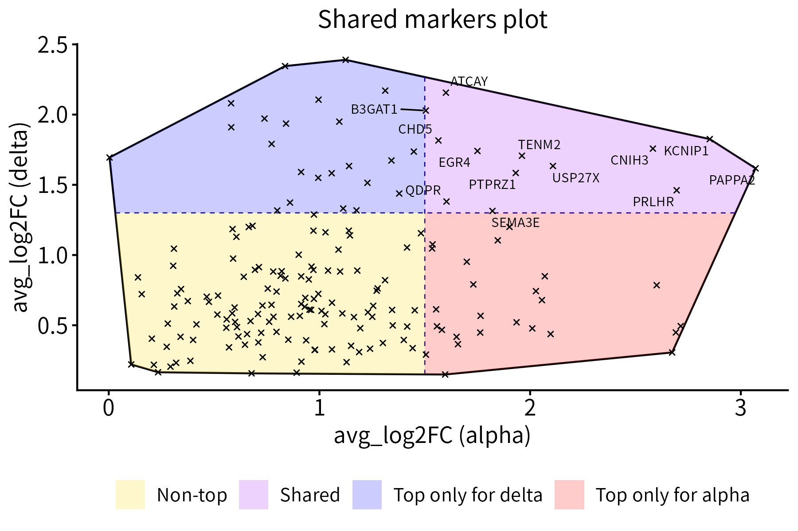
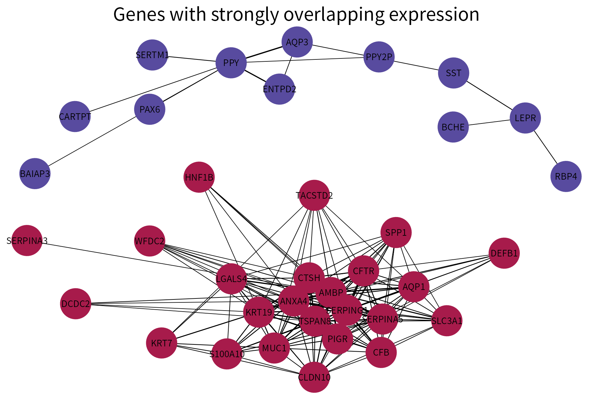
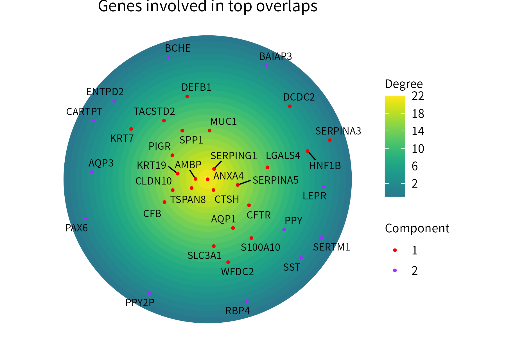
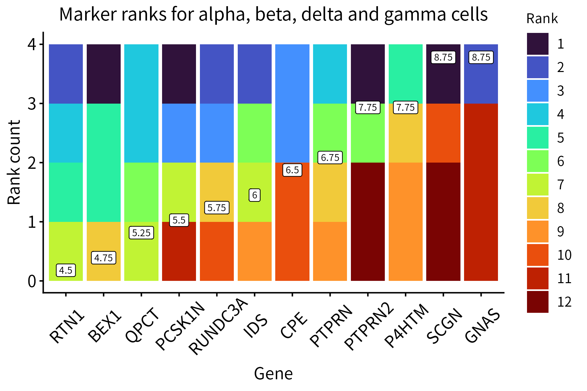
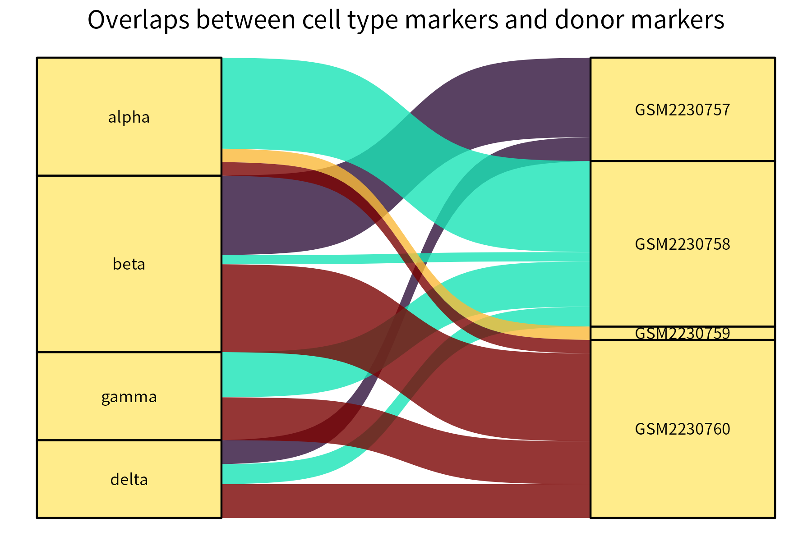
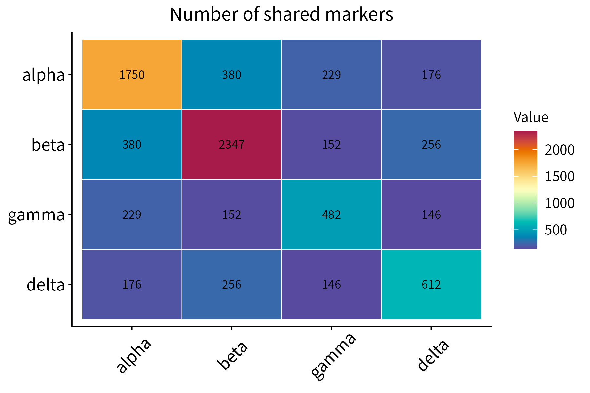
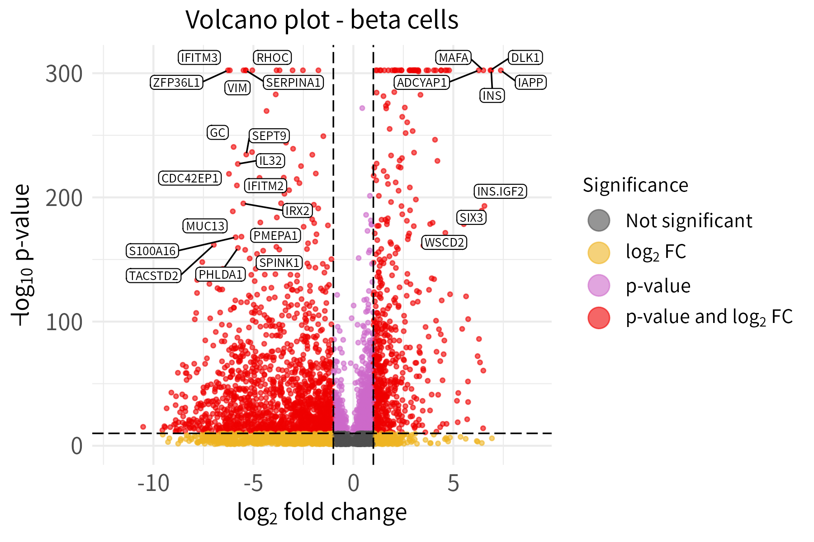

# henna
`henna` is a suite comprising several visualization utilities. 
They are designed with scRNA-seq data analysis in mind but are well-suited
to a variety of other applications as well.

## Installation

To install the version of `henna` currently available on CRAN, run the 
following R code:

```
install.packages("henna")
```

Alternatively, you can install the most recent development version using this 
code: 

```
devtools::install_github("andrei-stoica26/henna")
```

Currently, both versions are the same (`0.7.5`).

## Visualization tools

The data used to generate the figures presented here comes from the human Baron 
pancreas (HBP) dataset, which can be accessed through the [scRNAseq](https://bioconductor.org/packages/release/data/experiment/html/scRNAseq.html)
package.  The code used to generate the figures is provided in the 
[scripts](https://github.com/andrei-stoica26/henna/tree/main/inst/scripts) 
folder.

### classPlot

This function creates a bar plot that quantifies the items belonging
to different classes. Its required input is a data frame whose first two
columns are categorical (classes and items) and third column is numeric
(counts).



### correlationPlot

This function plots a correlation matrix. It accepts a matrix or data frame
as input.



### densityPlot

This function creates a density plot for a set of points, optionally displaying
segements between each point and its nearest neighbor. It requires a data frame
with the `x` and `y` coordinates of the points, which may additionally
contain score and nearest-neighbor columns.



### hullPlot

This function plots a set of points together with their convex hull. 
Optionally, it divides the points into 2 or 4 classes of different colors by 
drawing a vertical and/or a horizontal line that intersects the hull. It can
also label selected points. The required input is a data frame with `x` 
and `y` coordinates.



### networkPlot

This function plots a graph using different colors for nodes that are part of 
different connected components. It requires as input a data frame whose first
two columns are categorical and represent the vertices of the edges in a graph.
A numeric column representing either edge weights or edge ranks (these will
be converted into weights) can also be provided. If available, this column will
be used to vary edge width.



### radialPlot

This function plots positive numeric-valued points over concentric circles, 
with points located more centrally representing higher values. Optionally, the
points can be assigned to groups and colored on the basis of thes groups. 

The input data frame must store the point labels in its first column and their
numeric values in its second column. A third column (categorical) representing
the group where each point is assigned can also be provided.



### rankPlot
This function aggregates multiple ranks available for a group of items in a 
single plot. Average ranks can be displayed on the plot.



### riverPlot
This function generates an alluvial plot for a data frame with two categorical 
columns and a numeric column.

In the example below, it represents the significance of pairs of overlaps 
between the markers of groups belonging to two identity classes 
(cell type and donor). 



Stronger overlaps correspond to thicker connecting curves.

### tilePlot

This function plots a numeric matrix. It is a more general version of
`correlationPlot`.



### volcanoPlot

If the Bioconductor dependency [EnhancedVolcano](https://bioconductor.org/packages/release/bioc/html/EnhancedVolcano.html)
(not installed automatically with `henna`) is available, this function can be used
to create a volcano plot for a data frame with a log column and a p-value 
column. The gene names must be provided as row names.

Users can input labeled genes in two ways: 

1. By using p-value and log fold-change thresholds (the default option). 
2. By inputting a list of labels. 

The default option is preferred in the example below. To emphasize the usage 
of different thresholds for labeling and significance, the thresholds for
labeling are set much higher than the thresholds for significance.




