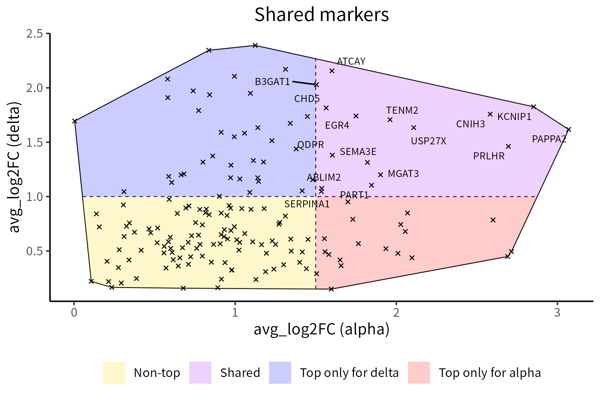

# henna
`henna` provides nine versatile visualization utilities. They are designed with 
scRNA-seq data analysis in mind, but can be used for a variety of other 
applications as well.

## Installation

To install the version of `henna` currently available on CRAN, run the 
following R code:

```
install.packages("henna")
```

Alternatively, you can install the most recent development version 
using this code:

```
devtools::install_github("andrei-stoica26/henna")
```

At present, both versions are the same (`0.3.4`). 

## Visualization tools

All tools are demonstrated here using the human Baron pancreas (HBP) dataset,
available as part of the [scRNAseq](https://bioconductor.org/packages/release/data/experiment/html/scRNAseq.html)
package.

### classPlot

This function creates a bar plot for a set of items grouped by class, ordering
the items and classes based on counts. An application is representing data 
coming from two categorical columns of a scRNA-seq expression object. Here, we
render selected donor and label information from the HBP dataset:


### correlationPlot

This function plots a correlation matrix. We use gene expression data
from the HBP dataset:


### densityPlot

This function creates a density plot for a set of points, optionally displaying
segements between each point and its nearest neighbor. Here, we subject 
expression data from the HBP dataset to a distance matrix calculation and
subsequent MDS reduction in order to generate the coordinates of the points:


### hullPlot

This function plots a set of points together with the convex hull. Optionally,
it divides the points into 2 or 4 classes of different colors by drawing a 
vertical and/or a horizontal line that intersects the hull.

An application is visualizing shared cluster markers. Here, we display the
shared markers of the alpha and delta clusters from the HBP dataset, 
highlighting the top ones in purple:



### networkPlot

This function plots a graph using different colors for nodes that are part of 
different connected components.

An application is visualizing genes with a strong overlapping expression in 
terms of cells showing the highest (90th percentile and above) expression
of the gene.


### radialPlot

This function plots positive integer-valued points over concentric circles, 
with points located more centrally representing higher values. 

It can be used to showcase genes involved in a network. Just like 
`networkPlot`, `radialPlot` can distinguish genes belonging to different
connected components:


### rankPlot
This function aggregates multiple ranks available for a group of items in a 
single plot. Average ranks can be displayed on the plot. Here, we visualize the
ranks of 12 genes as markers of the alpha, beta, delta and gamma clusters in 
the HBP dataset:


### riverPlot
This function generates an alluvial plot for a data frame with two categorical 
columns and a weights column. As an example, it can represent the significance
overlaps between cell type markers and donor markers in the HBP dataset. 
Stronger overlaps correspond to thicker connecting curves:


### tilePlot

This function plots a numeric matrix. Here, we use shared cluster markers as
an example:


